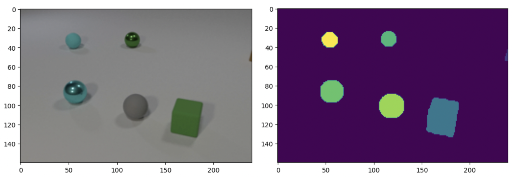

# Collision Prediction

This __collision-prediction__ repository contains Léo Dupire and Dhruv Shetty's final project code submission for the NYU graduate Deep Learning course taught by Yann LeCun and Alfredo Canziani. We are responding to the prompt specified in the [Deep_Learning_2023_Spring.pdf](./Deep_Learning_2023_Spring.pdf) file. In a few sentences, the task is as follows. _The model takes 11 consecutive images of objects (of varying shape) moving on a smooth white surface. The model must predict the segmenation mask of the scene after another 11 frames. i.e. the model must predict what position the objects will be in on the 22nd frame, understanding the underlying physics behind each object (velocity, material, collision properties)._ An example image-mask pair is shown below.

Example pair: 

Our solution consists of two [UNet](https://arxiv.org/abs/1505.04597) models. We first use a UNet for generating segmentation masks from the input images; we call this model the `Masker`. We feed the output of the Masker into the second UNet, which predicts the next mask eleven times until reaching the 22nd image. This process will be discussed further below. Note that this model takes only masks as input and ouputs a single mask; no color images are processed at this point. We call this second UNet the Predictor, as it predicts the subsequent positions of the objects. Naturally, we call the combination of these two UNets, __WNet__. 

## Instructions

0. A copy of the original data is available for download at this [link](https://drive.google.com/file/d/1bHl4sEOBRDXN3Hsb6aBIoY1piPj1-Bd2/view?usp=sharing). Unzipping this in the ./WNet/data directory will create a __Dataset_Student__ folder with train, val, and unlabeled folders, each with thousands of examples of data. the train and val folders

1. _Note: We have stored the training and validation data tensors in our submission. Therefore, you may skip to __step 2__._

    The [Data.ipynb](./WNet/Data.ipynb) notebook converts the images in the train, val, and unlabeled folders into PyTorch tensors. This will generate the `imgs.pt`, `val_imgs.pt`, `masks.pt`, `val_masks.pt`, and `unlabeled_imgs.pt` files (no masks are provided for the unlabeled set). These all live in [./WNet/data](./WNet/data). _Note: although we have provided the code for generating `unlabeled_imgs.pt`, we encourage the use of our lazy loading implementation that directly converts the raw images into a segmentation mask tensor. This is covered in the following step._

2. Now that we have our data tensors, we can move onto the [Masker.ipynb](./WNet/Masker.ipynb) notebook. Here, we will train our Masker model using `imgs.pt` and `masks.pt`, along with our validation tensors for verification of performance. The best Masker model weights will be saved into [./WNet/masker_models](./WNet/masker_models) as `best_masker.pth`. We recommend renaming this to a unique name to avoid overwiting in the future. We use `masker.pth`.

3. We can now train our Predictor model in [Predictor.ipynb](./WNet/Predictor.ipynb). The model can be trained on the aforementioned `masks.pt` data alone, with `val_masks.pt` for validation. This implementation is the default in the notebook. However, with some simple changes, the unlabeled data can be incorporated as well. Below, two approaches are explained (Changed must be made at indicated location under the _Load Data_ header in [Predictor.ipynb](./WNet/Predictor.ipynb)):

    * __Use full unlabeled data:__ Comment line 0 and uncomment lines 1, 2, and 3. 

    * __Use reduced unlabeled data:__ Comment line 0 and uncomment lines 1, 2, 3 __and__ 4. 

    The tensors created by this can be saved and loaded into a new kernel to preserve memory. The best Predictor model weights will be saved into [./WNet/predictor_models](./WNet/predictor_models) as `best_predictor.pth`. We recommend renaming this to a unique name to avoid overwiting in the future. We use `predictor.pth`.

4. Having settle both the Masker and Predictor model architectures, two .py files ([UNet_Masker.py](./WNet/UNet_Masker.py) & [UNet_Predictor.py](./WNet/UNet_Predictor.py)) were created for the respective models to facilitate the importing of these model architectures.

    Now we can build the WNet model! The [WNet.ipynb](./WNet/WNet.ipynb) notebook can be run without training as we already have two trained models (Masker & Predictor). This is what gave us our best final Jaccard Index score of 0.4212 on the validation set. To use this best-performing model, all cells in the notebook can be run apart from those under a 'Training' header and those under the 'Option 2' header. This will generate the predictions on the hidden set at the end of the notebook.

    Although it was unfruitful in our attempts, we have left the training options available in the notebook - we didn't get far into our experimentation with this. 'Option 1' will train the WNet model on the unchanged training image data, whereas 'Option 2' will train the WNet model on the unlabeled mask data. The reasoning behind training the WNet model itself is that we are then training the model on the true task it is trying to solve (predicting the 22nd image), as opposed to training the predictor on the subtask of predicting the next mask (predicting the 12th image).